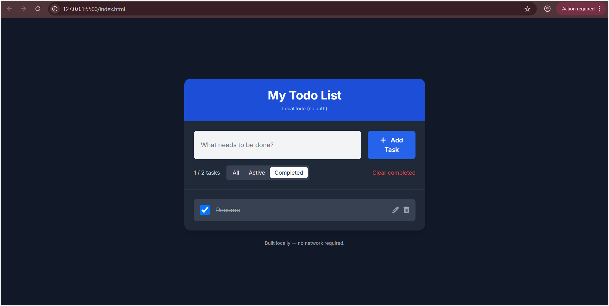

---

## 📝 Todo List Web App

[](LICENSE)
[](https://developer.mozilla.org/en-US/docs/Web/HTML)
[](https://developer.mozilla.org/en-US/docs/Web/CSS)
[](https://developer.mozilla.org/en-US/docs/Web/JavaScript)

---

## 📌 Project Description

A **simple, interactive Todo List web application** that helps you manage daily tasks efficiently.
Built with **HTML, CSS, and JavaScript**, this app is offline-friendly and stores todos locally in the browser. Perfect for personal use or as a beginner-friendly web project.

---

## 🚀 Features

* **Add Tasks** – Quickly add new todos.
* **Edit Tasks** – Modify existing todos inline.
* **Delete Tasks** – Remove tasks you no longer need.
* **Mark Complete/Incomplete** – Track your completed tasks.
* **Filter Todos** – View All, Active, or Completed tasks. *(if implemented)*
* **Clear Completed** – Remove all completed tasks at once. *(if implemented)*
* **Offline Ready** – Works entirely in the browser without internet.
* **Responsive UI** – Mobile and desktop friendly using Tailwind CSS.
* **Accessible Design** – Keyboard-friendly focus states included.

---

## 🎨 Screenshots

**Desktop View**



---

## 🛠 Technologies Used

* **HTML5** – Structure of the application
* **CSS3 + Tailwind CSS** – Styling and responsive design
* **JavaScript (ES6)** – Application logic (CRUD operations, DOM manipulation)
* **localStorage** – Browser-based storage for persistent todos

---

## ⚡ Installation & Usage

1. **Clone the repository**

   ```bash
   git clone https://github.com/yourusername/todo-app.git
   ```
2. **Open the app**
   Navigate to the project folder and open `index.html` in your browser.
3. **Start managing your tasks**

   * Add todos using the input box.
   * Edit, complete, or delete tasks as needed.
   * Use filters to view active or completed tasks.

> No backend setup is needed. Works entirely offline in the browser.

---

## 📂 File Structure

```
/todo-app
  ├─ index.html       # Main HTML file
  ├─ style.css        # Custom styles
  └─ app.js           # JavaScript functionality
```

---

## 📄 License

This project is licensed under the **MIT License**. Feel free to use and modify for personal or educational purposes.

---

## 👤 Author

Developed by [Your Name]
[GitHub Profile](https://github.com/maahi-reddy) | [LinkedIn](https://linkedin.com/in/mahika-dachireddy-b7002b369)

---